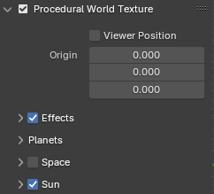
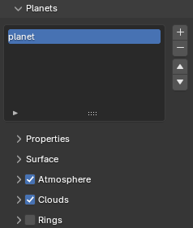
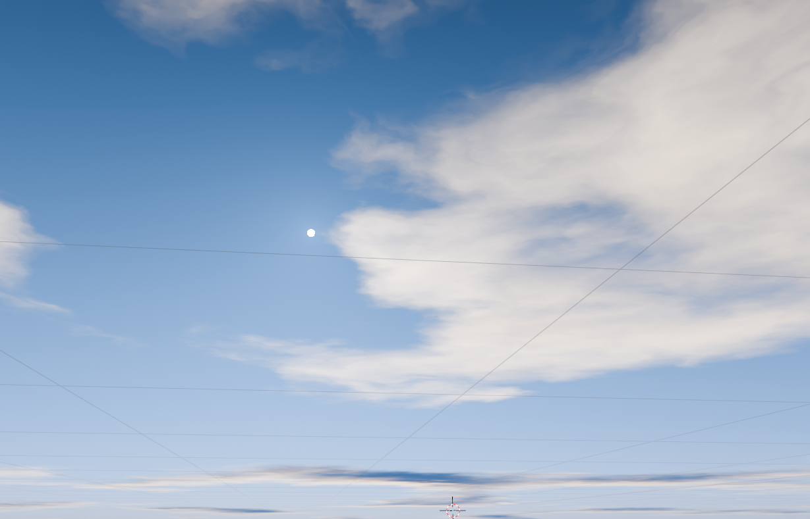
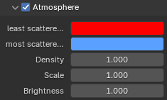
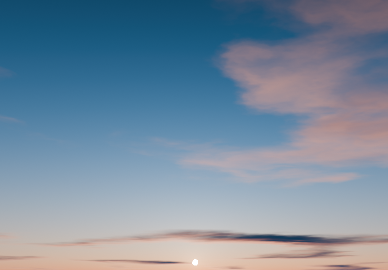
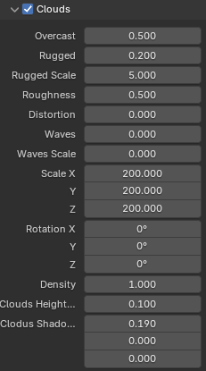
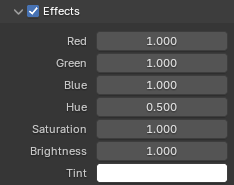
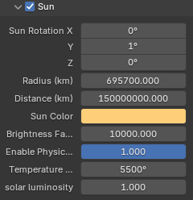
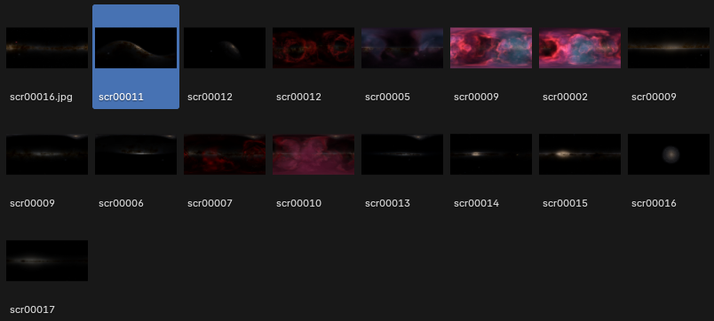
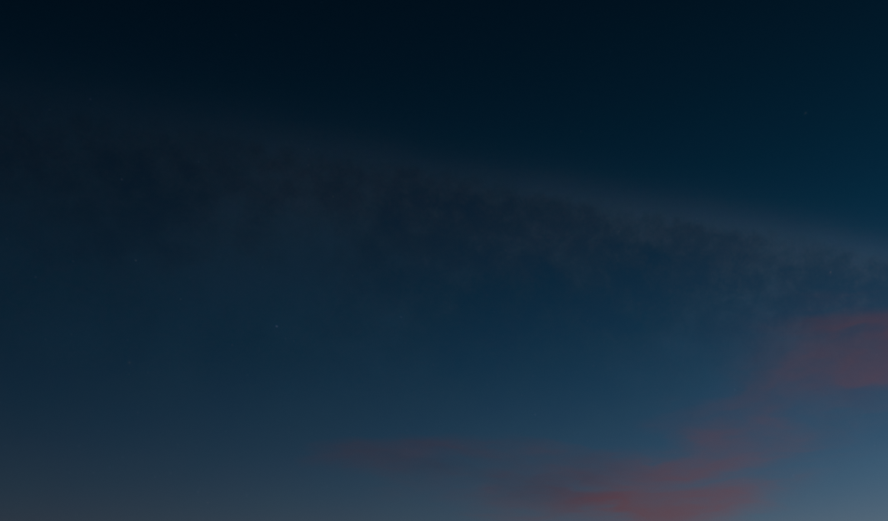

# Pro Atmo

Pro Atmo is an addon which enables procedural atmohsperic lighting using the world texture. Planets, clouds and atmosphere can be added and adjusted in real time.

## Planets

After installing the addon, you can use the "n panel" in the 3d-viewport. In order to add a planet, you need to enable the "pro atmo world" texture. Then you should see the following layout.

In the "Planets" section you can add a planet to the world texture. The planet is places right under the origin so the viewer is looking from the ground. The atmosphere and clouds settings are like on earth by default.

### Atmosphere

Further changes to the planet atmosphere can by made by changing those properties:

### Clouds

Especially useful for animations is the ability to change the position of the clouds. You can also change the density and many other options.

## Effects

In order to change the color or brightness of the whole world texture, you can use the "Effects" panel. In here you have many options to manage the colors.

Color adjustemnts are often used, when the scene is mostly done and you want to play around with different colors.

## Sun

The sun effects every planet added to the scene. By default the sun represents the sun in our solor-system, But you can change the size and brightness if you want to approach a sci-fi look.

## Space

The space isn't just pitch black, because of the billions of other suns in our galaxy. You can load different space-backgrounds to get a more realistic sky, especially for night-time renderings.

