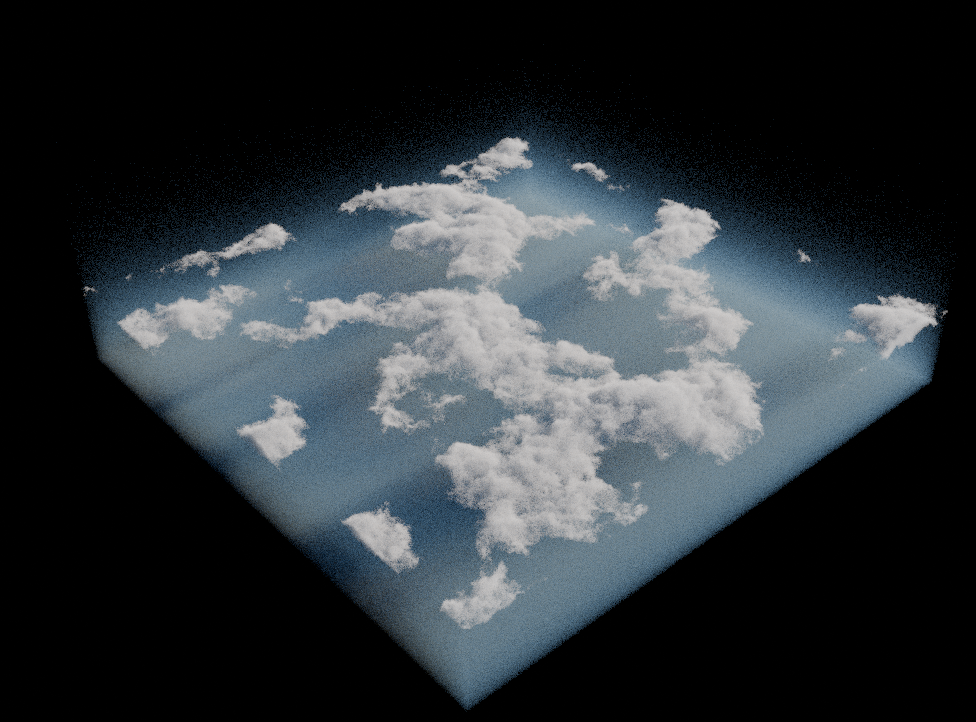

# Pro Atmo Extras

Pro Atmo Extras enables volumetric atmosphere and clouds rendering on an object level, which makes it possible to interact with other objects in the scene, giving it a depth and more realistic lighting. This is very useful for large environments giving the scene more depth.

It also enables you to quickly load hdri's in the world texture and adjust them.

## Volumetrics

An volumetric object can be added to the scene using the volumetrics panel in the 3d-viewport.

with this object selected, you change different properties in the following subpanels

## HDRI world texture

Using the "HDRI world texture" panel, you can quickly load HDRI's to the world texture.

First you need to specify a directory where all you HDRI's are stored, then you can load them, just by picking the one you want to load.

with an HDRI loaded, you can now change it properties using following sub-panels

